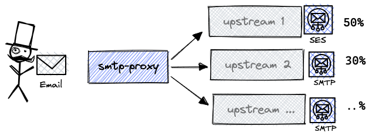

# smtpd-proxy

## What it is?

SMTPd-Proxy is a proxy (relay), to load balance multiple SMTP upstream servers.



**Motivation**
- E-mails and e-spam is sensitive topic. In my day-job we get our email accounts constantly suspended for days, and communicate with support to unblock.
- The other tool we rely to supports 1 SMTP server at a time.
- To tinker with Golang with something reasonably simple and non-trivial.

This is my first non-trivial Golang project and no doubt I have been wrongful, non idiomatic and plain stupid somewhere in the codebase. That said,
- you are free to not use this tool,
- you are kindly welcome to submit Contributions and provide helpful feedback to improve the code base or tool.

## Installation

Grab latest release from https://github.com/leonardinius/smtpd-proxy/releases/latest or build from source.

**Assets**
- [smtpd-proxy-darwin-amd64](https://github.com/leonardinius/smtpd-proxy/releases/latest/download/smtpd-proxy-darwin-amd64)
- [smtpd-proxy-darwin-arm64](https://github.com/leonardinius/smtpd-proxy/releases/latest/download/smtpd-proxy-darwin-arm64)
- [smtpd-proxy-linux-amd64](https://github.com/leonardinius/smtpd-proxy/releases/latest/download/smtpd-proxy-linux-amd64)
- [smtpd-proxy-linux-arm64](https://github.com/leonardinius/smtpd-proxy/releases/latest/download/smtpd-proxy-linux-arm64)
- [smtpd-proxy-windows-amd64.exe](https://github.com/leonardinius/smtpd-proxy/releases/latest/download/smtpd-proxy-windows-amd64.exe)
- [smtpd-proxy-windows-arm64.exe](https://github.com/leonardinius/smtpd-proxy/releases/latest/download/smtpd-proxy-windows-arm64.exe)
- [smtpd-proxy.yml](https://github.com/leonardinius/smtpd-proxy/releases/latest/download/smtpd-proxy.yml)

To build from source, make sure you have GNU make available.
```shell
$ make all
```

## Run & Configure

How-to run
```
./bin/smtpd-proxy --help
Usage:
  smtpd-proxy [OPTIONS]

Application Options:
  -c, --configuration= smtpd-proxy.yml configuration path (default: smtpd-proxy.yml) [$SMTPD_CONFIG]
  -v, --verbose        verbose mode [$VERBOSE]

Help Options:
  -h, --help           Show this help message

smtpd-proxy revision dirty-gitsha1
```

Configuration

```yaml
smtpd-proxy:
  # interface address smtpd-proxy will listen-to
  # use *:1025 to bind on localhost,
  # or 0.0.0.0:1025 to  listen on all interfaces
  listen: 127.0.0.1:1025

  # host identification
  ehlo: localhost

  # authentication.
  username: user
  password: secret
  # is_anon_auth_allowed: true

  # TLS cert and key.
  # server-cert: server.crt
  # server-key: server.key

  upstream-servers:
    - type: log
      weight: 10

    - type: smtp
      weight: 10
      settings:
        # host:port to conect to
        addr: smtp.mailtrap.io:2525
        # host identification, optional, needed for auth
        host: smtp.mailtrap.io

        # Auth methods available: login, plain, cram-md5, anon
        auth: plain
        username: 8333f344d8884e
        password: secret

    - type: ses
      weight: 1000
      settings:
        # AWS credentials, key ID
        aws_access_key_id: amz-key-1
        # AWS credentials, access secret key
        aws_secret_access_key: amz-**-secret
        # AWS API endpoint, e.g. localstack
        # endpoint: http://localhost:4566
        # region: us-east-1
```

tl;dr
- smtpd-proxy provides SMTP, plain + login auth, TLS (not tested)
- Upstreams: AWS SES, SMTP forward (plain, login, cram-md5), `log` for troubleshooting.

Example:
```shell
./bin/smtpd-proxy
smtpd-proxy revision dirty-gitsha1
2022-09-03T06:13:59.139+0300 info Parsing yaml at path: smtpd-proxy copy.yml
2022-09-03T06:13:59.141+0300 info Starting server at 127.0.0.1:1025 [EHLO localhost]
2022-09-03T06:14:38.272+0300 info log-forwarder {"uid": "uid:53ee46bd42803f97", "From": "from@example.com <from@example.com>", "To": ["Mailtrap Inbox to-30080-1128@example.com <to-30080-1128@exa
```

## Disclaimers

_Please read this section carefully; you should understand what to expect._
- This repo is remake of the `re:motivation` tool in spirit, no battle-tested in production. tl;dr status: Learning project.
- Code is provided as is, and I make no promises or guarantees about this tool.
- ⚠️ No Warranty: the subject software is provided "as is" without any warranty or support of any kind, either expressed, implied, or statutory. USE AT YOU OWN RISK.

## Contributions

- $ git checkout -b {change-subject}
- $ make lint test
- $ git add -A
- $ git commit -m 'Change subject description'
- $ git push -u origin HEAD
- [Submit Pull Request](https://help.github.com/articles/about-pull-requests/)

## Copyright

The code in this repository is copyrighted by respective authors. See LICENSE for details (MIT).
